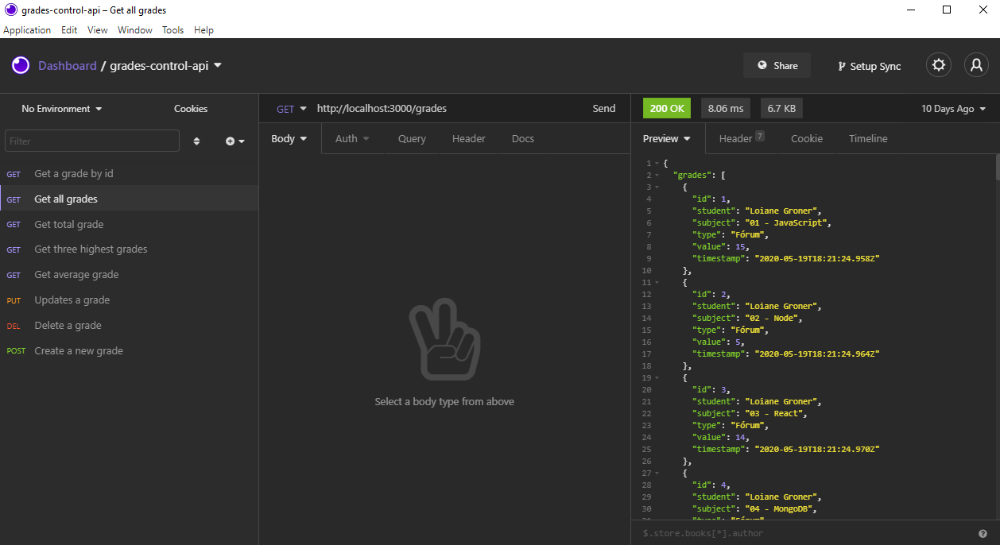

# grades-control-api
A Bootacamp IGTI exercise using Node.js and Express.

### get started
install dependencies<br/>
```npm install```

tart server<br/>
```nodemon index.js```

Base URL: <http://localhost:3000/grades>

